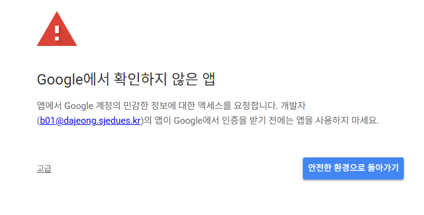

# 바탕화면 캘린더

Google Calendar 일정을 Windows 바탕화면에서 월·주·일 보기로 확인하는 읽기 전용 위젯입니다.

## 다운로드 및 로그인

GitHub Releases에서 최신 휴대용 ZIP을 내려받아 압축을 풀고 `바탕화면캘린더.exe`를 실행하세요.

Google 로그인 중 **Google에서 확인하지 않은 앱** 화면이 나오면 다음 순서로 진행합니다.

1. 왼쪽 아래의 **고급**을 누릅니다.
2. **바탕화면 캘린더(으)로 이동**을 누릅니다.
3. 캘린더 목록과 일정 읽기 권한을 허용합니다.

## 개인정보

앱은 캘린더 목록과 일정 읽기 권한만 요청합니다. 로그인 토큰과 일정 캐시는 현재 Windows 사용자 계정으로 암호화해 PC에 저장합니다.

지원: 25gyodongcho@gmail.com
